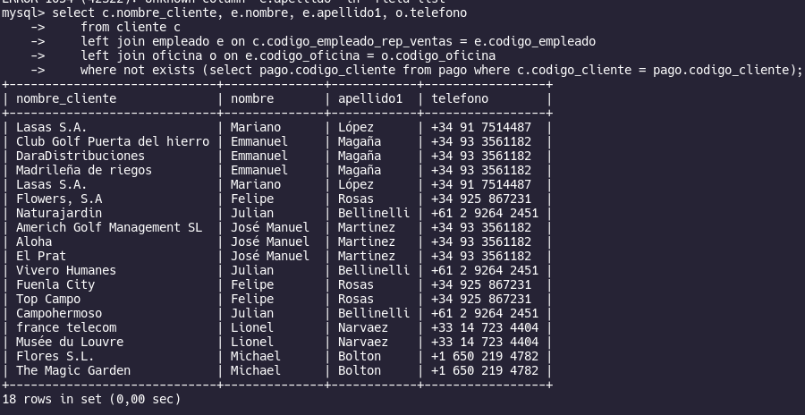

# Subconsultas

## Autores
- Jose Alejandro Gonzalez Ortiz
- Isaac Damian Arrieta Mercado
## A. Con operadores básicos de comparación:

1. Devuelve el nombre del cliente con mayor límite de crédito.

```sql
    select nombre_cliente 
    from cliente 
    where limite_credito = (select max(limite_credito) from cliente);
```


2. Devuelve el nombre del producto que tenga el precio de venta más caro.

```sql
    select nombre 
    from producto 
    where precio_venta = (select max(precio_venta) from producto);
```


3. Devuelve el nombre del producto del que se han vendido más unidades. (Tenga en
cuenta que tendrá que calcular cuál es el número total de unidades que se han vendido
de cada producto a partir de los datos de la tabla detalle_pedido. Una vez que sepa
cuál es el código del producto, puede obtener su nombre fácilmente.)

```sql
    SELECT p.nombre, dp.cantidad 
    FROM producto  p
    INNER JOIN detalle_pedido as dp ON p.codigo_producto = dp.codigo_producto
    WHERE cantidad = (SELECT MAX(cantidad) from detalle_pedido);
```


4. Los clientes cuyo límite de crédito sea mayor que los pagos que haya realizado. (Sin utilizar INNER JOIN).

```sql
    SELECT c.codigo_cliente, c.nombre_cliente, c.limite_credito, t.total
    FROM cliente c, (SELECT SUM(total) as total  from pago) as t
    WHERE limite_credito > t.total;
```


5. Devuelve el producto que más unidades tiene en stock.

```sql
    SELECT nombre, cantidad_en_stock 
    FROM producto 
    WHERE cantidad_en_stock = (SELECT max(cantidad_en_stock) FROM producto);
```


6. Devuelve el producto que menos unidades tiene en stock.

```sql
    SELECT nombre, cantidad_en_stock 
    FROM producto 
    WHERE cantidad_en_stock = (SELECT min(cantidad_en_stock) FROM producto);
```


7. Devuelve el nombre, los apellidos y el email de los empleados que están a cargo de
Alberto Soria.

```sql
    SELECT nombre, apellido1, apellido2, email 
    FROM empleado 
    WHERE nombre = 'Alberto' AND apellido1 = 'Soria';
```


## B. Subconsultas con ALL y ANY
8. Devuelve el nombre del cliente con mayor límite de crédito.

```sql
    SELECT nombre_cliente 
    FROM cliente 
    WHERE limite_credito >= ALL(SELECT (limite_credito) FROM cliente );
```


9. Devuelve el nombre del producto que tenga el precio de venta más caro.

```sql
    SELECT nombre,precio_venta 
    FROM producto 
    WHERE precio_venta >= ALL (SELECT(precio_venta) FROM producto);
```


10. Devuelve el producto que menos unidades tiene en stock.

```sql
    SELECT nombre, cantidad_en_stock 
    FROM producto 
    WHERE cantidad_en_stock <= ALL (SELECT (cantidad_en_stock) FROM producto);
```

## C. Subconsultas con IN y NOT IN
11. Devuelve el nombre, apellido1 y cargo de los empleados que no representen a ningún
cliente.

```sql
    SELECT nombre, apellido1, puesto 
    FROM empleado 
    WHERE codigo_empleado NOT IN (SELECT codigo_empleado_rep_ventas FROM cliente);
```


12. Devuelve un listado que muestre solamente los clientes que no han realizado ningún
pago.

```sql
    select codigo_cliente, nombre_cliente, nombre_contacto, apellido_contacto 
    from cliente
    where cliente.codigo_cliente not in (select pago.codigo_cliente from pago);
```


13. Devuelve un listado que muestre solamente los clientes que sí han realizado algún
pago.

```sql
    select codigo_cliente, nombre_cliente, nombre_contacto, apellido_contacto 
    from cliente
    where cliente.codigo_cliente in (select pago.codigo_cliente from pago);
```


14. Devuelve un listado de los productos que nunca han aparecido en un pedido.

```sql
    select codigo_producto, nombre 
    from producto 
    where producto.codigo_producto not in (select detalle_pedido.codigo_producto from detalle_pedido);
```


15. Devuelve el nombre, apellidos, puesto y teléfono de la oficina de aquellos empleados
que no sean representante de ventas de ningún cliente.

```sql
    select nombre, apellido1, apellido2, puesto, oficina.telefono 
    from empleado, oficina
    where empleado.codigo_empleado not in (select cliente.codigo_empleado_rep_ventas from cliente) 
    and empleado.codigo_oficina = oficina.codigo_oficina 
    and empleado.puesto = 'Representante Ventas';
```


16. Devuelve las oficinas donde no trabajan ninguno de los empleados que hayan sido los
representantes de ventas de algún cliente que haya realizado la compra de algún
producto de la gama Frutales.

```sql
    Select codigo_oficina
    from oficina 
    where oficina.codigo_oficina not in (select empleado.codigo_oficina from empleado
    where empleado.puesto = 'Representante Ventas' 
    and empleado.codigo_empleado in (select cliente.codigo_empleado_rep_ventas from cliente
    where cliente.codigo_cliente in (select pedido.codigo_cliente from pedido
    where pedido.codigo_pedido in (select detalle_pedido.codigo_pedido from detalle_pedido
    where detalle_pedido.codigo_producto in (select producto.codigo_producto from producto 
    where producto.gama = 'Frutales')))));
```


17. Devuelve un listado con los clientes que han realizado algún pedido, pero no han
realizado ningún pago.

```sql
    select codigo_cliente, nombre_cliente, nombre_contacto, apellido_contacto 
    from cliente
    where cliente.codigo_cliente in (select pedido.codigo_cliente from pedido)
    and cliente.codigo_cliente not in (select pago.codigo_cliente from pago);
```


## D. Subconsultas con EXISTS y NOT EXISTS
18. Devuelve un listado que muestre solamente los clientes que no han realizado ningún
pago.

```sql
    select codigo_cliente, nombre_cliente, nombre_contacto, apellido_contacto 
    from cliente 
    where exists (select pago.codigo_cliente from pago where cliente.codigo_cliente = pago.codigo_cliente);
```


19. Devuelve un listado que muestre solamente los clientes que sí han realizado ningún
pago.

```sql
    select codigo_cliente, nombre_cliente, nombre_contacto, apellido_contacto 
    from cliente 
    where not exists (select pago.codigo_cliente from pago where cliente.codigo_cliente = pago.codigo_cliente);
```


20. Devuelve un listado de los productos que nunca han aparecido en un pedido.

```sql
    select codigo_producto, nombre 
    from producto 
    where not exists (select detalle_pedido.codigo_producto from detalle_pedido where detalle_pedido.codigo_producto = producto.codigo_producto);
```


21. Devuelve un listado de los productos que han aparecido en un pedido alguna vez.

```sql
    select codigo_producto, nombre 
    from producto 
    where exists (select detalle_pedido.codigo_producto from detalle_pedido where detalle_pedido.codigo_producto = producto.codigo_producto);
```


## E. Subconsultas correlacionadas
### Consultas variadas:

22. Devuelve el listado de clientes indicando el nombre del cliente y cuántos pedidos ha
realizado. Tenga en cuenta que pueden existir clientes que no han realizado ningún
pedido.

```sql
```


23. Devuelve un listado con los nombres de los clientes y el total pagado por cada uno de
ellos. Tenga en cuenta que pueden existir clientes que no han realizado ningún pago.

```sql
    Select c.codigo_cliente, p.total 
    from cliente c  
    inner join (select codigo_cliente, sum(total) as total from pago group by codigo_cliente) p on c.codigo_cliente = p.codigo_cliente;
```


24. Devuelve el nombre de los clientes que hayan hecho pedidos en 2008 ordenados
alfabéticamente de menor a mayor.

```sql
```


25. Devuelve el nombre del cliente, el nombre y primer apellido de su representante de
ventas y el número de teléfono de la oficina del representante de ventas, de aquellos
clientes que no hayan realizado ningún pago.

```sql
```



26. Devuelve el listado de clientes donde aparezca el nombre del cliente, el nombre y
primer apellido de su representante de ventas y la ciudad donde está su oficina.

```sql
```


27. Devuelve el nombre, apellidos, puesto y teléfono de la oficina de aquellos empleados
que no sean representante de ventas de ningún cliente.

```sql
```


28. Devuelve un listado indicando todas las ciudades donde hay oficinas y el número de
empleados que tiene.

```sql
```


