# Procedimientos Almacenados
## Autores
- Isaac Damian Arrieta Mercado
- Jose Alejandro Gonzalez Ortiz
## Cargue De La Base De Datos Jardineria

<center>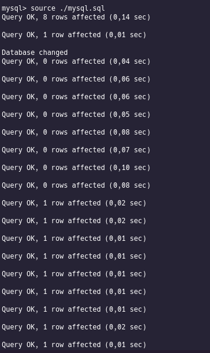</center>
<div style="page-break-after: always;"></div>


## Procedimientos sin sentencias

1. Escriba un procedimiento que no tenga ningún parámetro de entrada ni de salida y que muestre el texto ¡Hola mundo!

    ```sql
        DROP PROCEDURE IF EXISTS hola_mundo ;
        delimiter //
            CREATE PROCEDURE hola_mundo()
            BEGIN
            SELECT 'Hola mundo';
        END//
        delimiter ;

        CALL hola_mundo();
    ```

<center>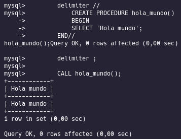</center>

2. Escriba un procedimiento que reciba un número real de entrada y muestre un mensaje indicando si el número es positivo, negativo o cero.

    ```sql
        DROP PROCEDURE IF EXISTS numposneg ;
        delimiter //
        CREATE PROCEDURE numposneg(IN numero NUMERIC)
        BEGIN IF numero > 0 THEN SELECT 'Numero positivo';
        ELSEIF numero < 0 THEN SELECT 'Nuemro negativo';
        ELSE SELECT 'El numero es cero';
        END IF;
        END//
        delimiter ;

        CALL numposneg(-9);
    ```

<center>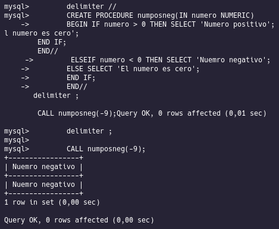</center>

3. Modifique el procedimiento diseñado en el ejercicio anterior para que tenga un parámetrode entrada, con el valor un número real, y un parámetro de salida, con una cadena decaracteres indicando si el número es positivo, negativo o cero.

    ```sql
        DROP PROCEDURE IF EXISTS mensaje_tipo;
        DELIMITER //
        CREATE PROCEDURE mensaje_tipo(IN numero NUMERIC, OUT mensaje VARCHAR(40))
        BEGIN
            IF numero > 0 THEN
                SET mensaje = 'Positivo';
            ELSEIF numero < 0 THEN
                SET mensaje = 'Negativo';
            ELSE
                SET mensaje = 'Cero';
            END IF;
        END//
        DELIMITER ;
        CALL mensaje_tipo(1, @mensaje);
        select @mensaje;
    ```

<center>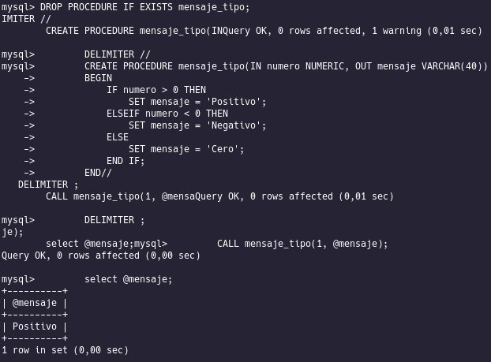</center>

4. Escriba un procedimiento que reciba un número real de entrada, que representa el valorde la nota de un alumno, y muestre un mensaje indicando qué nota ha obtenido teniendo en cuenta las siguientes condiciones:

* [0,5) = Insuficiente
* [5,6) = Aprobado
* [6, 7) = Bien
* [7, 9) = Notable
* [9, 10] = Sobresaliente
* En cualquier otro caso la nota no será válida

    ```sql
        DROP PROCEDURE IF EXISTS mensaje_nota;
        delimiter //
        CREATE PROCEDURE mensaje_nota(IN nota NUMERIC)
        BEGIN
            IF nota >= 0 AND nota < 5 THEN
                SELECT 'Insuficiente';
            ELSEIF nota >= 5 AND nota < 6 THEN
                SELECT 'Aprobado';
            ELSEIF nota >= 6 AND nota < 7 THEN
                SELECT 'Bien';
            ELSEIF nota >= 7 AND nota < 9 THEN
                SELECT 'Notable';
            ELSEIF nota >= 9 AND nota <= 10 THEN
                SELECT 'Sobresaliente';
            ELSE
                SELECT 'No es una nota válida';
            END IF;
        END//
        delimiter ;
        
        CALL mensaje_nota(8);
    ```

<center>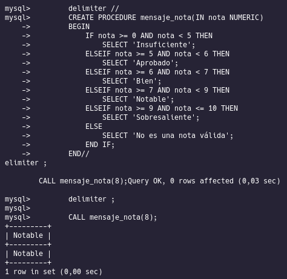</center>

5.  Modifique el procedimiento diseñado en el ejercicio anterior para que tenga un parámetrode entrada, con el valor de la nota en formato numérico y un parámetro de salida, con unacadena de texto indicando la nota correspondiente.

    ```sql
        DROP PROCEDURE IF EXISTS mensaje_nota;
        delimiter //
        CREATE PROCEDURE mensaje_nota(IN nota NUMERIC, OUT mensaje VARCHAR(40))
        BEGIN
            IF nota >= 0 AND nota < 5 THEN
                SET mensaje = 'Insuficiente';
            ELSEIF nota >= 5 AND nota < 6 THEN
                SET mensaje = 'Aprobado';
            ELSEIF nota >= 6 AND nota < 7 THEN
                SET mensaje = 'Bien';
            ELSEIF nota >= 7 AND nota < 9 THEN
                SET mensaje = 'Notable';
            ELSEIF nota >= 9 AND nota <= 10 THEN
                SET mensaje = 'Sobresaliente';
            ELSE
                SET mensaje = 'No es una nota válida';
            END IF;
        END//
        delimiter ;
        CALL mensaje_nota(1, @mensaje);
        SELECT @mensaje;
    ```

<center>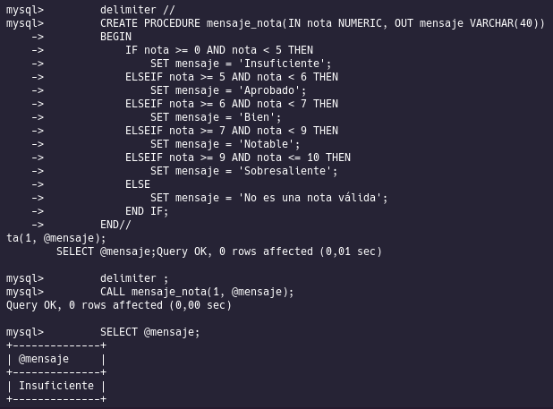</center>

6. Resuelva el procedimiento diseñado en el ejercicio anterior haciendo uso de la estructurade control CASE. 

    ```sql
        DROP PROCEDURE IF EXISTS mensaje_nota_case;
        delimiter //
        CREATE PROCEDURE mensaje_nota_case(IN nota NUMERIC, OUT mensaje VARCHAR(40))
        BEGIN
            CASE
                WHEN nota BETWEEN 0 AND 5 THEN
                    SET mensaje = 'Insuficiente';
                WHEN nota BETWEEN 5 AND 6 THEN
                    SET mensaje = 'Aprobado';
                    WHEN nota BETWEEN 6 AND 7 THEN
                    SET mensaje = 'Bien';
                WHEN nota BETWEEN 7 AND 9 THEN
                    SET mensaje = 'Notable';
                WHEN nota BETWEEN 9 AND 10 THEN
                    SET mensaje = 'Sobresaliente';
                ELSE
                    SET mensaje = 'No es una nota válida';
            END CASE;
        END//
        delimiter ;
        CALL mensaje_nota_case(1, @mensaje);
        SELECT @mensaje;
    ```

<center>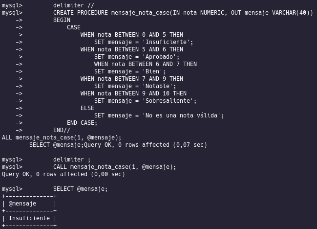</center>

7. Escriba un procedimiento que reciba como parámetro de entrada un valor numérico querepresente un día de la semana y que devuelva una cadena de caracteres con el nombre del día de la semana correspondiente. Por ejemplo, para el valor de entrada 1 debería devolver la cadena lunes.

    ```sql
        DROP PROCEDURE IF EXISTS dia_semana;
        delimiter //
        CREATE PROCEDURE dia_semana(IN nota NUMERIC, OUT mensaje VARCHAR(40))
        BEGIN
            CASE nota
                WHEN 0 THEN
                    SET mensaje = 'Domingo';
                WHEN 1 THEN
                    SET mensaje = 'Lunes';
                WHEN 2 THEN
                    SET mensaje = 'Martes';
                WHEN 3 THEN
                    SET mensaje = 'Miercoles';
                WHEN 4 THEN
                    SET mensaje = 'Jueves';
                WHEN 5 THEN
                    SET mensaje = 'Viernes';
                WHEN 6 THEN
                    SET mensaje = 'Sabado';
                ELSE
                    SET mensaje = 'No es un dia valido';
            END CASE;
        END//
        delimiter ;
        CALL dia_semana(10, @mensaje);
        SELECT @mensaje;
    ```

<center>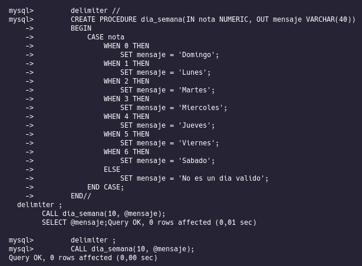</center>
<center>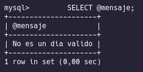</center>

## Procedimientos con sentencias SQL1.

1. Escriba un procedimiento que reciba el nombre de un país como parámetro de entrada y realice una consulta sobre la tabla cliente para obtener todos los clientes que existen en la tabla de ese país.

    ```sql
        DROP PROCEDURE IF EXISTS clientes_pais;
        delimiter //
        CREATE PROCEDURE clientes_pais(IN recibe_pais VARCHAR(40))
        BEGIN
            SELECT codigo_cliente, nombre_cliente, pais FROM cliente WHERE pais = recibe_pais;
        END//
        delimiter ;
        CALL clientes_pais('Colombia');
    ```

<center>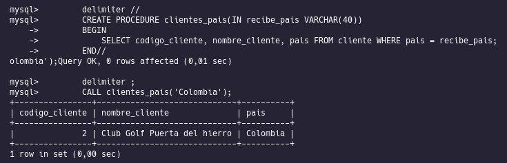</center>

2. Escriba un procedimiento que reciba como parámetro de entrada una forma de pago, que será una cadena de caracteres (Ejemplo:PayPal, Transferencia, etc.). Y devuelva comosalida el pago de máximo valor realizado para esa forma de pago. Deberá hacer uso de la tabla pago de la base de datos jardinería.

    ```sql
        DROP PROCEDURE IF EXISTS max_pago;
        delimiter //
        CREATE PROCEDURE max_pago(IN metodo_pago VARCHAR(40))
        BEGIN
            SELECT MAX(total) FROM pago WHERE forma_pago = metodo_pago;
        END//
        delimiter ;
        CALL max_pago('PayPal');
    ```

<center>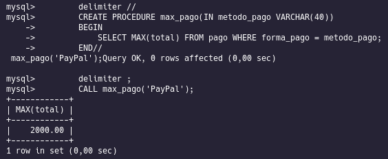</center>

3. Escriba un procedimiento que reciba como parámetro de entrada una forma de pago, queserá una cadena de caracteres (Ejemplo:PayPal,Transferencia, etc). Y devuelva como salida los siguientes valores teniendo en cuenta la forma de pago seleccionada comoparámetro de entrada:

* el pago de máximo valor,
* el pago de mínimo valor,
* el valor medio de los pagos realizados,
* la suma de todos los pagos,
* el número de pagos realizados para esa forma de pago.

    Deberá hacer uso de la tabla pago de la base de datos jardinería.

    ```sql
        DROP PROCEDURE IF EXISTS pago_forma;
        delimiter //
        CREATE PROCEDURE pago_forma(IN metodo_pago VARCHAR(40))
        BEGIN
        SELECT MAX(total), MIN(total), AVG(total), SUM(total), COUNT(total) FROM pago WHERE forma_pago = metodo_pago;
        END//
        delimiter ;
        CALL pago_forma('Transferencia');
    ```

<center>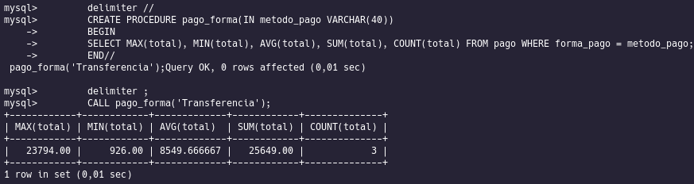</center>


4. Crear una base de datos llamada “procedimientos01” que contenga una tabla llamada operaciones.  La tabla operaciones debe tener dos columnas de tipo INT UNSIGNED,una columna llamada “numero” y otra llamada “cuadrado”.

### Cargue de la Base de datos

<center>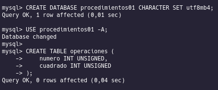</center>

Una   vez   creada   la   base   de   datos   y   la   tabla   deberá crear un procedimiento llamado calcular_cuadrados con   las   siguientes características.   El procedimiento recibe un parámetro de entrada llamado tope de tipo INT UNSIGNED y calculará el valor de los cuadrados de los primeros números naturales hasta el valor introducido como parámetro. El valor del número y de sus cuadrados deberán ser almacenados en la tabla cuadrados que hemos creado previamente.

Tenga en cuenta que el procedimiento deberá eliminar el contenido actual de la tabla antes de insertar los nuevos valores de los cuadrados que va a calcular.

Utilice un bucle WHILE para resolver el procedimiento.

    ```sql
    DROP PROCEDURE IF EXISTS calcular_cuadrados;
    delimiter // 
    CREATE PROCEDURE calcular_cuadrados(IN tope INT)
    BEGIN
    DECLARE i INT;
    DECLARE cuadrado INT;
    SET i = 1;
    DELETE FROM operaciones;
    WHILE (i <= tope) DO
    SET cuadrado = i * i;
    INSERT INTO operaciones VALUES(i, cuadrado);
    SET i = i + 1;
    END WHILE;
    END //
    delimiter ;
    CALL calcular_cuadrados(10);
    SELECT * FROM operaciones;
    ```

<center>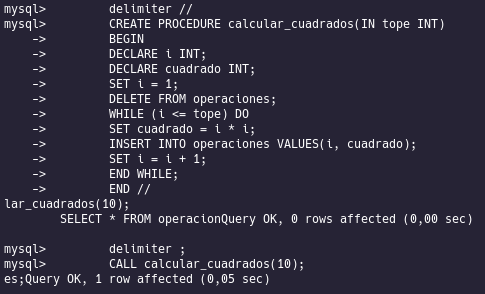</center>
<center></center>

5. Utilice un bucle REPEAT para resolver el procedimiento del ejercicio anterior.

    ```SQL
        DROP PROCEDURE IF EXISTS calcular_cuadrados;
        delimiter $$
        CREATE PROCEDURE calcular_cuadrados(IN tope INT)
        BEGIN
            DECLARE i INT;
            DECLARE cuadrado INT;
            SET i = 1;
            DELETE FROM operaciones;
            REPEAT
                SET cuadrado = i * i;
                INSERT INTO operaciones VALUES(i, cuadrado);
                SET i = i + 1;
            UNTIL (i < tope);
            END REPEAT ;
            SELECT * FROM operaciones;
        END; $$
        CALL calcular_cuadrados(10);
        
    ```

6. Utilice un bucle LOOP para resolver el procedimiento del ejercicio anterior.

    ```SQL
        DROP PROCEDURE IF EXISTS calcular_cuadrados;
        delimiter // 
        CREATE PROCEDURE calcular_cuadrados(IN tope INT)
        BEGIN
        DECLARE i INT;
        DECLARE cuadrado INT;
        SET i = 1;
        DELETE FROM operaciones;
        ciclo: LOOP
        SET cuadrado = i * i;
        INSERT INTO operaciones VALUES(i, cuadrado);
        SET i = i + 1;
        IF (i > tope) THEN
        LEAVE ciclo;
        ELSE 
        ITERATE ciclo;
        END IF;
        END LOOP;
        END; //
        delimiter ;
        CALL calcular_cuadrados(10);
        SELECT * FROM operaciones;
    ```

7. Crear una base de datos llamada “procedimientos02” que contenga una tabla llamada ejercicio. La tabla debe tener una única columna llamada “numero” y el tipo de dato de esta columna debe ser INT UNSIGNED.

    Una   vez   creada   la   base   de   datos   y   la   tabla   deberá crear   un procedimiento llamado calcular_números con   las   siguientes   características.   El procedimiento   recibe   un   parámetro   de   entrada   llamado valor_inicial de tipo INT UNSIGNED y deberá almacenar en la tabla ejercicio toda la secuencia de números desde el valor inicial pasado como entrada hasta el 1.

    Tenga en cuenta que el procedimiento deberá eliminar el contenido actual de las tablas antes de insertar los nuevos valores.

    Utilice un bucle WHILE para resolver el procedimiento.

    ```sql
    DROP PROCEDURE IF EXISTS calcular_numeros;
    delimiter //
    CREATE PROCEDURE calcular_numeros(IN valor_inicial INT UNSIGNED)
    BEGIN
    DECLARE i INT;
    SET i = valor_inicial;
    DELETE FROM ejercicio;
    WHILE (i != 0) DO
    INSERT INTO ejercicio VALUES(i);
    SET i = i - 1;
    END WHILE;
    END //
    delimiter ;
    CALL calcular_numeros(10);
    SELECT * FROM ejercicio;
    ```

8. Utilice un bucle REPEAT para resolver el procedimiento del ejercicio anterior. 

    ```sql
    DROP PROCEDURE IF EXISTS calcular_numeros;
    delimiter //
    CREATE PROCEDURE calcular_numeros(IN valor_inicial INT UNSIGNED)
    BEGIN
    DECLARE i INT;
    SET i = valor_inicial;
    DELETE FROM ejercicio;
    REPEAT
    INSERT INTO ejercicio VALUES(i);
    SET i = i - 1;
    UNTIL (i == 0);
    END REPEAT;
    END //
    delimiter ;
    CALL calcular_numeros(10);
    SELECT * FROM ejercicio;
    ```

9. Utilice un bucle LOOP para resolver el procedimiento del ejercicio anterior.

    ```sql
    DROP PROCEDURE IF EXISTS calcular_numeros;
    delimiter //
    CREATE PROCEDURE calcular_numeros(IN valor_inicial INT UNSIGNED)
    BEGIN
    DECLARE i INT;
    SET i = valor_inicial;
    DELETE FROM ejercicio;
    ciclo: LOOP
    INSERT INTO ejercicio VALUES(i);
    SET i = i - 1;
    IF (i == 0) THEN
    LEAVE ciclo;
    ELSE 
     ITERATE ciclo;
    END IF;
    END LOOP;
    END //
    delimiter ;
    CALL calcular_numeros(10);
    SELECT * FROM ejercicio;
    ```

10. Crea unabase de datos llamada procedimientos que contenga una tabla llamada pares y otra tabla llamada impares. Las dos tablas deben tener única columna llamada número y el tipo de dato de esta columna debe ser INT UNSIGNED. 

    Una   vez   creada   la   base   de   datos   y   las   tablas   deberácrear   un procedimiento llamado calcular_pares_impares con   las   siguientes   características.   El procedimiento recibe un parámetro de entrada llamado tope de tipo INT UNSIGNED y deberá almacenar en la tabla pares aquellos números pares que existan entre el número 1el valor introducido como parámetro. Habrá que realizar la misma operación para  almacenar los números impares en la tabla impares.

    Tenga en cuenta que el procedimiento deberá eliminar el contenido actual de las tablas antes de insertar los nuevos valores. 

    Utilice un bucle WHILE para resolver el procedimiento.

    ```sql
    DROP PROCEDURE IF EXISTS calcular_pares_impares;
    delimiter //
    CREATE PROCEDURE calcular_pares_impares(IN tope INT UNSIGNED)
    BEGIN
    DECLARE i INT;
    SET i = 1;
    DELETE FROM pares;
    DELETE FROM impares;
    WHILE (i <= tope) DO
    IF (i % 2 = 0) THEN
    INSERT INTO pares VALUES(i);
    ELSE
    INSERT INTO impares VALUES(i);
    END IF;
    SET i = i + 1;
    END WHILE;
    END //
    delimiter ;
    CALL calcular_pares_impares(10);
    SELECT * FROM pares;
    SELECT * FROM impares;
    ```

11. Utilice un bucle REPEAT para resolver el procedimiento del ejercicio anterior.

    ```sql
    DROP PROCEDURE IF EXISTS calcular_pares_impares;
    delimiter //
    CREATE PROCEDURE calcular_pares_impares(IN tope INT UNSIGNED)
    BEGIN
    DECLARE i INT;
    SET i = 1;
    DELETE FROM pares;
    DELETE FROM impares;
    REPEAT
    IF (i % 2 = 0) THEN
    INSERT INTO pares VALUES(i);
    ELSE
    INSERT INTO impares VALUES(i);
    END IF;
    SET i = i + 1;
    UNTIL (i > tope);
    END REPEAT;
    END //
    delimiter ;
    CALL calcular_pares_impares(10);
    SELECT * FROM pares;
    SELECT * FROM impares;
    ```

12. Utilice un bucle LOOP para resolver el procedimiento del ejercicio anterior.

    ```sql
    DROP PROCEDURE IF EXISTS calcular_pares_impares;
    delimiter //
    CREATE PROCEDURE calcular_pares_impares(IN tope INT UNSIGNED)
    BEGIN
    DECLARE i INT;
    SET i = 1;
    DELETE FROM pares;
    DELETE FROM impares;
    ciclo: LOOP
    IF (i % 2 = 0) THEN
    INSERT INTO pares VALUES(i);
    ELSE
    INSERT INTO impares VALUES(i);
    END IF;
    SET i = i + 1;
    IF (i > tope) THEN
    LEAVE ciclo;
    ELSE 
     ITERATE ciclo;
    END IF;
    END LOOP;
    END //
    delimiter ;
    CALL calcular_pares_impares(10);
    SELECT * FROM pares;
    SELECT * FROM impares;
    ```
## Transacciones con procedimientos almacenados

1. Crea una base de datos llamada cine que contengados tablas con las siguientes columnas.

    Tabla cuentas:

    * id_cuenta: entero sin signo (clave primaria).
    * saldo: real sin signo.

    Tabla entradas:

    * id_butaca: entero sin signo (clave primaria). 
    * nif: cadena de 9 caracteres.

    Una   vez   creada   la   base   de   datos   y   las   tablas   deberá crear   un procedimiento llamado comprar_entrada con   las   siguientes   características.   El procedimiento recibe 3 parámetros  de entrada(nif,id_cuenta,id_butaca) y devolverá como salida un parámetro llamado error que tendrá un valor igual a 0 si la compra de la entrada se ha podido realizar con éxito y un valor igual a 1 en caso contrario.

    El procedimiento de compra realiza los siguientes pasos:

    * Inicia una transacción.

* Actualiza la columnas saldo de la tabla cuentas cobrando 5 euros a la cuenta con el id_cuenta adecuado.

    * Inserta una una fila en la tabla entradas indicando la butaca (id_butaca) que acaba de comprar el usuario (nif).

    * Comprueba si ha ocurrido algún error en las operaciones anteriores. Si no ocurre ningún error entonces aplica un COMMIT a la transacción y si ha ocurrido algún error aplica un ROLLBACK.Deberá manejar los siguientes errores que puedan ocurrir durante el proceso.

    * ERROR 1264 (Out of range value).
    * ERROR 1062 (Duplicate entry for PRIMARY KEY).

    ```sql
        DROP PROCEDURE IF EXISTS comprar_entrada; 
        delimiter //
        CREATE PROCEDURE comprar_entrada (IN nif VARCHAR(9),
                                        IN id_cuenta INT UNSIGNED, 
                                        IN id_butaca INT UNSIGNED,
                                        OUT error TINYINT UNSIGNED)
        BEGIN 
            DECLARE EXIT HANDLER FOR 1264, 1062 
            BEGIN 
            SET error= 1;
                ROLLBACK;
            END;
            
        START TRANSACTION;
        SET error = 0;

        UPDATE cuentas SET saldo = saldo - 5 
        WHERE cuentas.id_cuenta = id_cuenta;

        INSERT INTO entradas VALUES(id_butaca,nif);
        COMMIT;
        END//
        delimiter ;

        CALL comprar_entrada('11111111A', 1, 10,@error);
        CALL comprar_entrada('11111111A', 1, 11,@error);
        CALL comprar_entrada('11111111A', 1, 12,@error);
        CALL comprar_entrada('11111111A', 1, 13,@error);
        CALL comprar_entrada('11111111A', 1, 14,@error);
        CALL comprar_entrada('22222222B', 2, 10,@error);

        SELECT @error;
        SELECT * FROM cuentas;
        SELECT * FROM entradas;
    ```


2. ¿Qué ocurre cuando intentamos comprar una entrada y le pasamos como parámetro un número de cuenta que no existe en la tabla cuentas? ¿Ocurre algún error o podemos comprar la entrada?  En caso de que exista algún error, ¿cómo podríamos resolverlo?
    ```sql
        DROP PROCEDURE IF EXISTS comprar_entrada;
        delimiter //
        CREATE PROCEDURE comprar_entrada (IN nif VARCHAR(9),
                                        IN id_cuenta INT UNSIGNED, 
                                        IN id_butaca INT UNSIGNED,
                                        OUT error TINYINT UNSIGNED)
        BEGIN 
            DECLARE saldo_cliente DECIMAL UNSIGNED;
            DECLARE EXIT HANDLER FOR 1264, 1062 
            BEGIN 
            SET error= 1;
                ROLLBACK;
            END;
            SET error = 0;
            SET saldo_cliente = (SELECT saldo FROM cuentas WHERE cuentas.id_cuenta = id_cuenta);
        IF saldo_cliente >= 5 THEN 
            START TRANSACTION;
            UPDATE cuentas SET saldo = saldo- 5 
            WHERE cuentas.id_cuenta = id_cuenta;
            INSERT INTO entradas VALUES(id_butaca,nif);
        IF error = 0 THEN
            COMMIT;
        ELSE
            ROLLBACK;
        END IF;
        ELSE
            SET error = 1;
            END IF;
        END//
        delimiter ;

        CALL comprar_entrada('44444444A',3,11,@error);
        SELECT * FROM cuentas;
        SELECT * FROM entradas;
        SELECT@error;
    ```

## Funciones con sentencias SQL

1. Escribe una función para la base de datos tienda que devuelva el número total de productos que hay en la tabla productos.

    ```sql
        DROP FUNCTION IF EXISTS numero_total_productos;
        delimiter //
        CREATE FUNCTION numero_total_productos()
            RETURNS INT
            READS SQL DATA
            DETERMINISTIC
        BEGIN
        DECLARE total INT;
            SET total = (SELECT COUNT(*) FROM productos);
            RETURN total;
        END; //
        delimiter ;

        SELECT numero_total_productos();
    ```

2. Escribe una función para la base de datos tienda que devuelva el valor medio del precio de los productos de un determinado fabricante que se recibirá como parámetro de entrada. El parámetro de entrada será el nombre del fabricante.

    ```sql
        DROP FUNCTION IF EXISTS precio_medio;
        delimiter //
        CREATE FUNCTION precio_medio(nombre_fabricante VARCHAR(50))
            RETURNS float
            READS SQL DATA
            DETERMINISTIC
        BEGIN
        DECLARE media float;
            SET media = (SELECT AVG(productos.precio) FROM productos 
            INNER JOIN fabricante ON fabricante.id = productos.fabricante_id WHERE fabricante.nombre = nombre_fabricante);
            RETURN media;
        END; //
        delimiter ;

        SELECT precio_medio('Apple');
    ```

3. Escribe una función para la base de datos tienda que devuelva el valor máximo del precio de los productos de un determinado fabricante que se recibirá como parámetro de entrada. El parámetro de entrada será el nombre del fabricante.

    ```sql
        DROP FUNCTION IF EXISTS precio_medio;
        delimiter //
        CREATE FUNCTION precio_medio(nombre_fabricante VARCHAR(50))
            RETURNS float
            READS SQL DATA
            DETERMINISTIC
        BEGIN
        DECLARE media float;
            SET media = (SELECT MAX(productos.precio) FROM productos 
            INNER JOIN fabricante ON fabricante.id = productos.fabricante_id WHERE fabricante.nombre = nombre_fabricante);
            RETURN media;
        END; //
        delimiter ;

        SELECT precio_medio('Apple');
    ```

4. Escribe una función para la base de datos tienda que devuelva el valor mínimo del precio de los productos de un determinado fabricante que se recibirá como parámetro de entrada. El parámetro de entrada será el nombre del fabricante.

    ```sql
        DROP FUNCTION IF EXISTS precio_medio;
        delimiter //
        CREATE FUNCTION precio_medio(nombre_fabricante VARCHAR(50))
            RETURNS float
            READS SQL DATA
            DETERMINISTIC
        BEGIN
        DECLARE media float;
            SET media = (SELECT MIN(productos.precio) FROM productos 
            INNER JOIN fabricante ON fabricante.id = productos.fabricante_id WHERE fabricante.nombre = nombre_fabricante);
            RETURN media;
        END; //
        delimiter ;

        SELECT precio_medio('Apple');
    ```