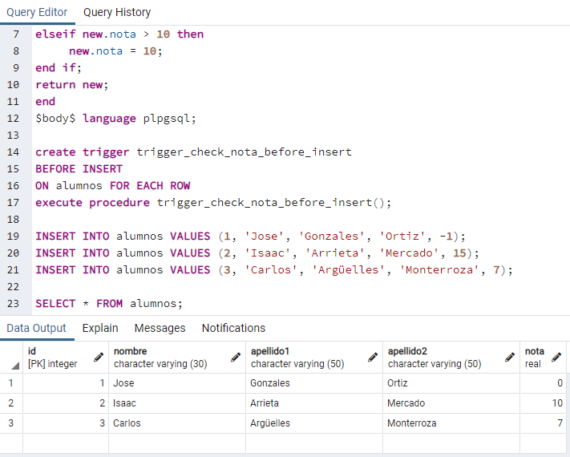
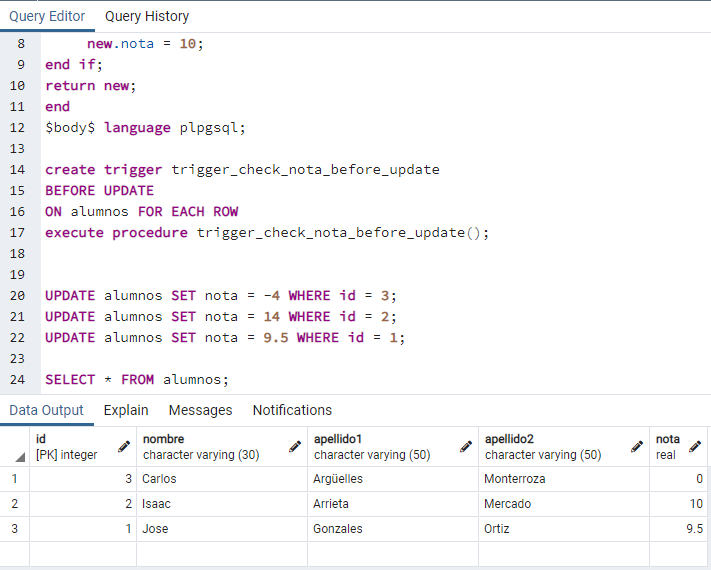
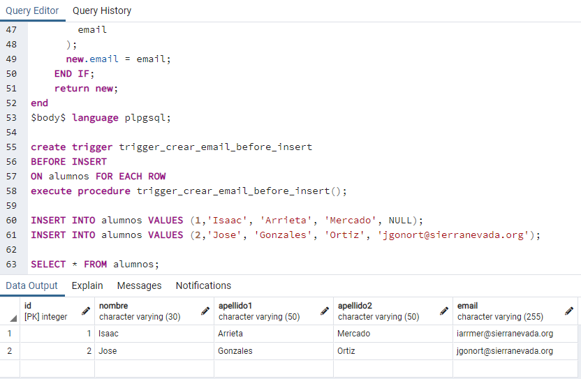
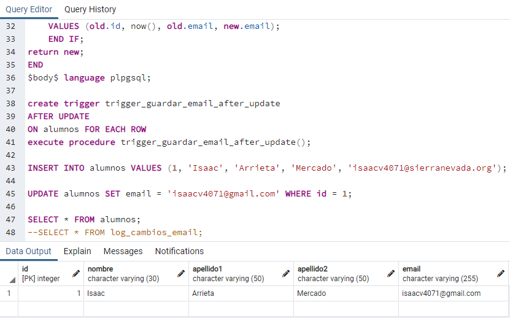
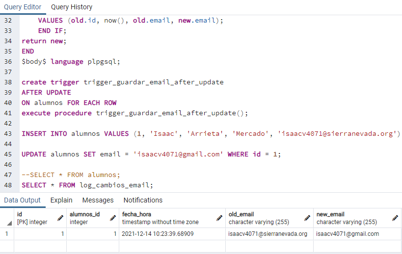
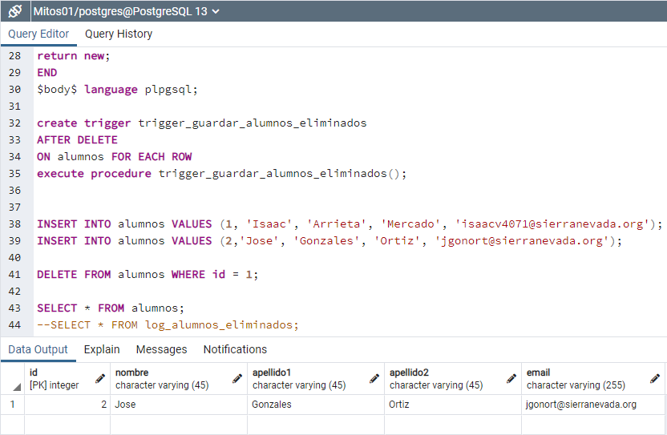
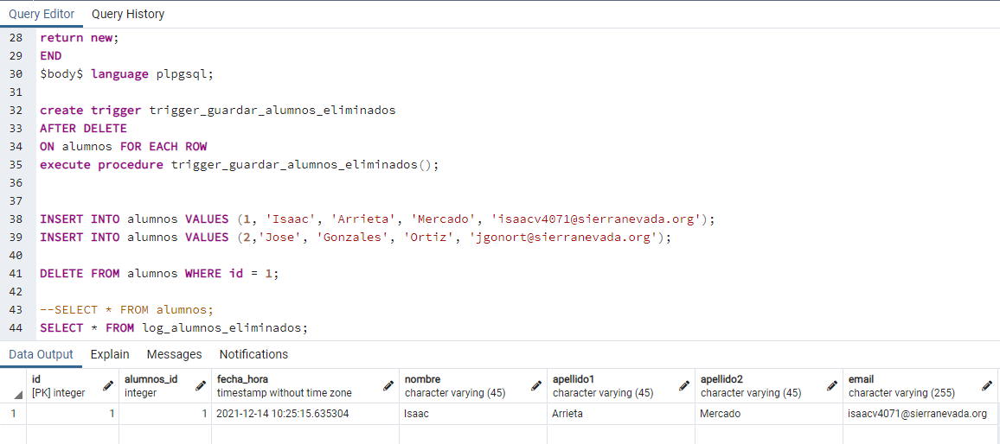

# Triggers
## Autores
- Isaac Damian Arrieta Mercado
- Jose Alejandro Gonzalez Ortiz

## Ejercicios

1. Crear unabase de datos llamada Mitest01 que contenga una tabla llamada alumnos con las siguientes columnas.
Tabla alumnos:
    * id(entero sin signo)
    * nombre(cadena de caracteres)
    * apellido1(cadena de caracteres)
    * apellido2(cadena de caracteres)
    * nota(número real)

    ```sql
    DROP TABLE IF EXISTS alumnos;

    CREATE TABLE alumnos (
    id INTEGER NOT NULL,
    nombre VARCHAR(30) NOT NULL,
    apellido1 VARCHAR(50) NOT NULL,
    apellido2 VARCHAR(50) NOT NULL,
    nota REAL NOT NULL,
    PRIMARY KEY (id)
    );
    ```

    Una vez creada la tabla escriba dos triggers con las siguientes características:  

    Trigger 1:trigger_check_nota_before_inserto

    * Se ejecuta sobre la tabla alumnos.
    * Se ejecuta antes de una operación deinserción.
    * Si el nuevo valor de la nota que se quiere insertar es negativo, se guarda como 0.
    * Si el nuevo valor de la nota que se quiere insertar es mayor que 10, se guarda como 10.

    ```sql
    DROP TRIGGER if exists trigger_check_nota_before_insert ON alumnos;

    create or replace function trigger_check_nota_before_insert()
    returns trigger as $body$
    begin
    if new.nota < 0 then
        new.nota = 0;
    elseif new.nota > 10 then
        new.nota = 10;
    end if;
    return new;
    end
    $body$ language plpgsql;

    create trigger trigger_check_nota_before_insert
    BEFORE INSERT
    ON alumnos FOR EACH ROW
    execute procedure trigger_check_nota_before_insert();

    INSERT INTO alumnos VALUES (1, 'Jose', 'Gonzales', 'Ortiz', -1);
    INSERT INTO alumnos VALUES (2, 'Isaac', 'Arrieta', 'Mercado', 15);
    INSERT INTO alumnos VALUES (3, 'Carlos', 'Argüelles', 'Monterroza', 7);

    SELECT * FROM alumnos;
    ```
    <center></center>

    Trigger2: trigger_check_nota_before_update

    * Se ejecuta sobre la tabla alumnos.
    * Se ejecuta antes de una operación deactualización.
    * Si el nuevo valor de la nota que se quiere actualizar es negativo, se guarda como 0.
    * Si el nuevo valor de la nota que se quiere actualizar es mayor que 10, se guarda como 10.

    ```sql
    DROP TRIGGER if exists trigger_check_nota_before_update ON alumnos;

    create or replace function trigger_check_nota_before_update()
    returns trigger as $body$
    begin
    if new.nota < 0 then
        new.nota = 0;
    elseif new.nota > 10 then
        new.nota = 10;
    end if;
    return new;
    end
    $body$ language plpgsql;

    create trigger trigger_check_nota_before_update
    BEFORE UPDATE
    ON alumnos FOR EACH ROW
    execute procedure trigger_check_nota_before_update();


    UPDATE alumnos SET nota = -4 WHERE id = 3;
    UPDATE alumnos SET nota = 14 WHERE id = 2;
    UPDATE alumnos SET nota = 9.5 WHERE id = 1;

    SELECT * FROM alumnos;
    ```
    <center></center>

2. Crear una base de datos llamada Mitest02 que contenga una tabla llamada alumnos con las siguientes columnas.
Tabla alumnos: 
    * id(entero sin signo)
    * nombre(cadena de caracteres)
    * apellido1(cadena de caracteres)
    * apellido2(cadena de caracteres)
    * email(cadena de caracteres)

    ```sql
    DROP TABLE IF EXISTS alumnos;

    CREATE TABLE alumnos (
    id INTEGER NOT NULL,
    nombre VARCHAR(30) NOT NULL,
    apellido1 VARCHAR(50) NOT NULL,
    apellido2 VARCHAR(50) NOT NULL,
    email VARCHAR(255),
    PRIMARY KEY (id)
    );
    ```

    Escriba un procedimiento llamado crear_email que dados los   parámetros de entrada: nombre, apellido1, apellido2 y dominio,   cree una dirección de email y la devuelva como salida.

    * Procedimiento: crear_email
    * Entrada:
        * nombre(cadena de caracteres)
        * apellido1(cadena de caracteres)
        * apellido2(cadena de caracteres)
        * dominio(cadena de caracteres)
    * Salida:
        * email(cadena de caracteres)
    
    ```sql
    create or replace procedure crear_email(
        in nombre VARCHAR(30),
        in apellido1 VARCHAR(50),
        in apellido2 VARCHAR(50),
        in dominio VARCHAR(50),
        inout email VARCHAR(255)
    )
    language plpgsql    
    as $$
    begin
    email = CONCAT(
        substring(nombre,1,1),
        substring(apellido1,1,3),
        substring(apellido2,1,3),
        '@',
        dominio
        );
    
            email = lower(email);
        end;
    $$ ;
    ```
    
    Devuelva una dirección de correo electrónico con el siguiente formato:

    * El primer carácter del parámetro nombre.
    * Los tres primeros caracteres del parámetro apellido1.
    * Los tres primeros caracteres del parámetro apellido2.
    * El carácter@.
    * El dominio pasado como parámetro.

    Una vez creada la tabla escriba un trigger con las siguientes características:

    * Trigger: trigger_crear_email_before_inserto
        * Se ejecuta sobre la tabla alumnos.
        * Se ejecuta antes de una operación de inserción.
        * Si el nuevo valor del email que se quiere insertar es NULL, entonces se le creará automáticamente una dirección de email y se insertará en la tabla.
        * Si el nuevo valor del email no es NULL se guardará en la tabla el valor del email.

    ```sql
    create or replace function trigger_crear_email_before_insert()
    returns trigger as $body$
    DECLARE email VARCHAR(150);
    DECLARE dominio VARCHAR(50);
    begin
        dominio = 'sierranevada.org';
        if new.email is NULL THEN
        call crear_email(
            new.nombre,
            new.apellido1,
            new.apellido2,
            dominio,
            email
        );
        new.email = email;
        END IF;
        return new;
    end
    $body$ language plpgsql;

    create trigger trigger_crear_email_before_insert
    BEFORE INSERT
    ON alumnos FOR EACH ROW
    execute procedure trigger_crear_email_before_insert();

    INSERT INTO alumnos VALUES (1,'Isaac', 'Arrieta', 'Mercado', NULL);
    INSERT INTO alumnos VALUES (2,'Jose', 'Gonzales', 'Ortiz', 'jgonort@sierranevada.org');

    SELECT * FROM alumnos;
    ```
    <center></center>

3. Modificar el ejercicio anterior y añade un nuevo trigger que las siguientes características:

    Trigger: trigger_guardar_email_after_update:

    * Se ejecuta sobre la tablaalumnos.
    * Se ejecutadespuésde una operación deactualización.
    * Cada vez que un alumno modifique su dirección de email se deberá insertar un nuevo registro en una tabla llamada log_cambios_email.

    La tabla log_cambios_email contiene los siguientes campos:

    * id: clave primaria (entero autonumérico)
    * id_alumno: id del alumno (entero)
    * fecha_hora: marca de tiempo con el instante del cambio (fecha y hora)* old_email: valor anterior del email (cadena de caracteres)
    * new_email: nuevo valor con el que se ha actualizado

    ```sql
    DROP TABLE IF EXISTS alumnos cascade;
    DROP TABLE IF EXISTS log_cambios_email cascade;

    CREATE TABLE alumnos (
    id INTEGER   NOT NULL ,
    nombre VARCHAR(30)   NOT NULL ,
    apellido1 VARCHAR(50)   NOT NULL ,
    apellido2 VARCHAR(50)   NOT NULL ,
    email VARCHAR(255)      ,
    PRIMARY KEY(id));


    CREATE TABLE log_cambios_email (
    id SERIAL  NOT NULL ,
    alumnos_id INTEGER   NOT NULL ,
    fecha_hora TIMESTAMP    ,
    old_email VARCHAR(255)    ,
    new_email VARCHAR(255)      ,
    PRIMARY KEY(id)  ,
    FOREIGN KEY(alumnos_id)
        REFERENCES alumnos(id));


    CREATE INDEX log_cambios_email_FKIndex1 ON log_cambios_email (alumnos_id);
    CREATE INDEX IFK_Rel_01 ON log_cambios_email (alumnos_id);

    CREATE or REPLACE function trigger_guardar_email_after_update()
    returns trigger as $body$
    BEGIN
        if old.email <> new.email THEN
        INSERT INTO log_cambios_email (alumnos_id, fecha_hora, old_email, new_email)
        VALUES (old.id, now(), old.email, new.email);
        END IF;
    return new;
    END
    $body$ language plpgsql;

    create trigger trigger_guardar_email_after_update
    AFTER UPDATE
    ON alumnos FOR EACH ROW
    execute procedure trigger_guardar_email_after_update();

    INSERT INTO alumnos VALUES (1, 'Isaac', 'Arrieta', 'Mercado', 'isaacv4071@sierranevada.org');

    UPDATE alumnos SET email = 'isaacv4071@gmail.com' WHERE id = 1;

    SELECT * FROM alumnos;
    SELECT * FROM log_cambios_email;
    ```
    <center></center>
    <center></center>

4. Modificar el ejercicio anterior y añade un nuevo trigger que   tenga las siguientes características:

    Trigger: trigger_guardar_alumnos_eliminados:
    * Se ejecuta sobre la tabla alumnos.
    * Se ejecuta despuésde una operación de borrado.
    * Cada vez que se elimine un alumno de la tabla alumnos se deberá insertar unnuevo registro en una tabla llamada log_alumnos_eliminados.

    La tabla log_alumnos_eliminados contiene los siguientes campos:
    * id: clave primaria (entero autonumérico)
    * id_alumno: id del alumno (entero)
    * fecha_hora: marca de tiempo con el instante del cambio (fecha y hora)
    * nombre: nombre del alumno eliminado (cadena de caracteres)
    * apellido1: primer apellido del alumno eliminado (cadena de caracteres)
    * apellido2: segundo apellido del alumno eliminado (cadena de caracteres)
    * email: email del alumno eliminado (cadena de caracteres)

    ```sql
    DROP TABLE IF EXISTS alumnos cascade;
    DROP TABLE IF EXISTS log_alumnos_eliminados cascade;

    CREATE TABLE alumnos (
    id INTEGER   NOT NULL ,
    nombre VARCHAR(45)    ,
    apellido1 VARCHAR(45)    ,
    apellido2 VARCHAR(45)    ,
    email VARCHAR(255)      ,
    PRIMARY KEY(id));

    CREATE TABLE log_alumnos_eliminados (
    id SERIAL  NOT NULL ,
    alumnos_id INTEGER   NOT NULL ,
    fecha_hora TIMESTAMP    ,
    nombre VARCHAR(45)   NOT NULL ,
    apellido1 VARCHAR(45)   NOT NULL ,
    apellido2 VARCHAR(45)   NOT NULL ,
    email VARCHAR(255)      ,
    PRIMARY KEY(id));


    CREATE or REPLACE function trigger_guardar_alumnos_eliminados()
    returns trigger as $body$
    BEGIN
        INSERT INTO log_alumnos_eliminados (alumnos_id, fecha_hora, nombre, apellido1, apellido2, email)
        VALUES (old.id, now(), old.nombre, old.apellido1, old.apellido2, old.email);
    return new;
    END
    $body$ language plpgsql;

    create trigger trigger_guardar_alumnos_eliminados
    AFTER DELETE
    ON alumnos FOR EACH ROW
    execute procedure trigger_guardar_alumnos_eliminados();


    INSERT INTO alumnos VALUES (1, 'Isaac', 'Arrieta', 'Mercado', 'isaacv4071@sierranevada.org');
    INSERT INTO alumnos VALUES (2,'Jose', 'Gonzales', 'Ortiz', 'jgonort@sierranevada.org');

    DELETE FROM alumnos WHERE id = 1;

    SELECT * FROM alumnos;
    SELECT * FROM log_alumnos_eliminados;
    ```

    <center></center>
    <center></center>