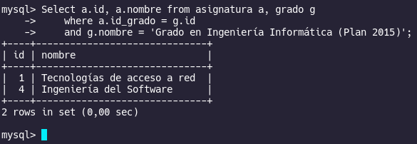
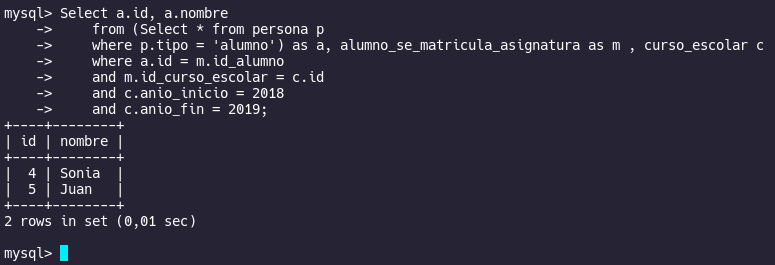
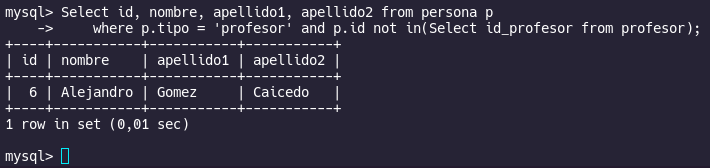
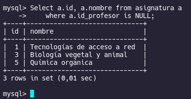
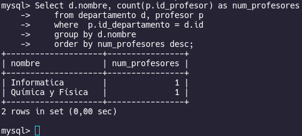
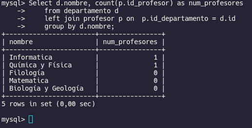
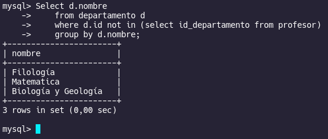

# Ejercicio 01

## Hecho Por
-  Jose Alejandro Gonzalez Ortiz 

## Punto 01

- Devuelve un listado con todas las  asignaturas  ofertadas  en el Grado en Ingeniería
Informática (Plan 2015).

```sql
    Select a.id, a.nombre from asignatura a, grado g 
    where a.id_grado = g.id 
    and g.nombre = 'Grado en Ingeniería Informática (Plan 2015)';
```


- Devuelve un listado con todos los alumnos que se han matriculado en alguna asignatura durante el curso escolar 2018/2019.

```sql
    Select a.id, a.nombre
    from (Select * from persona p
    where p.tipo = 'alumno') as a, alumno_se_matricula_asignatura as m , curso_escolar c
    where a.id = m.id_alumno 
    and m.id_curso_escolar = c.id
    and c.anio_inicio = 2018
    and c.anio_fin = 2019;
```


## Punto 02

- Devuelve un listado con los profesores que no están asociados a un departamento.

```sql
    Select id, nombre, apellido1, apellido2 from persona p
    where p.tipo = 'profesor' 
    and p.id not in(Select id_profesor from profesor);
```


- Devuelve un listado con las asignaturas que no tienen un profesor asignado.

```sql
    Select a.id, a.nombre from asignatura a 
    where a.id_profesor is NULL;
```


## Punto 03

- Calcula cuántos profesores hay en cada departamento. El resultado sólo debe mostrar dos
columnas, una con el nombre del departamento y otra con el número de profesores que
hay en ese departamento. El resultado sólo debe incluir los departamentos que tienen
profesores asociados y deberá estar ordenado de mayor a menor por el número de
profesores.

```sql
    Select d.nombre, count(p.id_profesor) as num_profesores
    from departamento d, profesor p
    where  p.id_departamento = d.id
    group by d.nombre
    order by num_profesores desc;
```


- Devuelve un listado con todos los departamentos y el número de profesores que hay en
cada uno de ellos. Tenga en cuenta que pueden existir departamentos que no tienen
profesores asociados. Estos departamentos también tienen que aparecer en el listado.

```sql
    Select d.nombre, count(p.id_profesor) as num_profesores
    from departamento d
    left join profesor p on  p.id_departamento = d.id
    group by d.nombre;
```


## Punto 04

- Devuelve todos los datos del alumno más joven.

```sql
    Select * from persona p
    where p.tipo = 'alumno'
    order by p.fecha_nacimiento desc
    limit 1;
```


- Devuelve un listado con los departamentos que no tienen profesores asociados.

```sql
    Select d.nombre
    from departamento d
    where d.id not in (select id_departamento from profesor)
    group by d.nombre;
```
